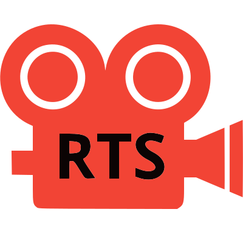

	

# 3D RTS Camera - Godot Addon

A fully customizable and easy-to-use **3D RTS-style Camera** for Godot 4.3. Intuitive camera movement for real-time strategy games or other projects requiring a top-down camera with RTS-like controls.

---

## Features

- Smooth zooming with adjustable limits
- Orbit camera around a center point
- Edge scrolling
- Keyboard movement with configurable speed
- Shift key speed boost
- Middle mouse button control for pitch and rotation

---

## Installation

1. [Download the latest release](https://github.com/emilhakala/3d-rts-camera/releases/latest)
   
2. **Copy to Your Project**
   - Unpack the `addons/3d_rts_camera` folder into your `/addons` folder within the Godot project.
---

## How to Use

1. Add  `rtscam.tscn` from the `addons/3d_rts_camera` folder to your main scene.

2. Configure your RTS camera:
   - Select the `RTScamera` node in your scene and adjust the custom properties in the Inspector panel to fit your project needs (e.g., move speed, zoom limits, rotation speed, etc.).

---

## Compatibility

- Requires **Godot 4.3** or later.

---

## License

This project is licensed under the **MIT License**. See the [LICENSE](LICENSE) file for details.

---
